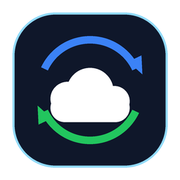

# Google Drive Sync Lite (Go + Wails Modern Edition)



Легковесная, надежная и сверхбыстрая альтернатива официальному клиенту Google Диск, написанная на **Go** с нативным современным интерфейсом на **Wails v2** (WebView2, без Electron и без Node.js), системным треем, инсталлятором Windows и алгоритмом дельта-синхронизации больших библиотек (115 000+ файлов).

---

## Ключевые возможности:

1. **Современный нативный интерфейс (Wails v2 & Fluent Glassmorphism)**:
   - Бесшовное frameless-окно с кастомным заголовком, поддержкой перетаскивания и акриловыми/Mica эффектами.
   - Идеально скругленные темные скроллбары без устаревших белых системных полос.
   - Анимированные карточки статуса, переключатели в стиле iOS/Windows 11, неоновые индикаторы и интерактивный терминал журнала событий.
   - Полное отсутствие тяжеловесного Electron и зависимостей Node.js.

2. **Мгновенная дельта-синхронизация (Fast Delta Engine)**:
   - При повторных синхронизациях локальные файлы сканируются за ~1-2 секунды (проверка `mtime` + `size` против базы данных SQLite в режиме WAL).
   - Если файлы не менялись, синхронизация завершается моментально без холостых сетевых запросов к Google Drive.
   - Обрабатываются и выгружаются только новые или измененные файлы.

3. **Режим полного зеркала (Local Master / Mirror) и Two-Way**:
   - Локальный диск является главным источником правды.
   - Полное сохранение иерархии папок и подпапок.
   - Защита от дубликатов папок и файлов.

4. **Системный трей Windows (Native System Tray)**:
   - Иконка в области уведомлений Windows (возле часов).
   - Всплывающее контекстное меню по правому клику:
     - 📂 *Открыть интерфейс*
     - 🔄 *Синхронизировать сейчас*
     - ⏹ *Остановить*
     - ❌ *Выход*
   - Сворачивание в трей при закрытии или нажатии «Свернуть в трей».
   - Информативная всплывающая подсказка (Tooltip) с текущим статусом.

5. **Автономность и безопасность (Zero Data Loss & Disconnect Guard)**:
   - **Защита от отключения диска (Disconnect Guard)**: если съемный накопитель или диск не подключен, синхронизация немедленно блокируется, предотвращая ложное удаление файлов из облака.
   - **Якорь безопасности (.google_sync_anchor)**: аппаратная проверка доступности накопителя.
   - **Защита от повторного запуска (Single Instance Named Mutex)**: исключает запуск дубликатов программы. Повторный запуск лишь активирует и разворачивает уже работающее окно.
   - **Восстановление из Корзины (Restore from Trash)**: встроенная кнопка и CLI-параметр `-restore` для быстрого пакетного возврата ошибочно удаленных элементов.
   - Потоковое вычисление контрольных сумм MD5 без избыточного расхода оперативной памяти.
   - Встроенная база SQLite (`sync_state_go.db`) на чистом Go (без CGO / gcc) с надежным WAL журналом.
   - Самопроверка целостности байт-в-байт (кнопка *«Самопроверка MD5»*).

6. **Полноценный установщик Windows**:
   - Скомпилирован через Inno Setup: `GoogleSyncLite_Setup_v1.1.0.exe`.
   - Создает ярлыки на Рабочем столе и в меню Пуск.
   - Опция автозапуска при старте Windows.
   - Чистое удаление через стандартную панель Windows «Установка и удаление программ».

---

## Установка и запуск

### Вариант 1. Установщик Windows (Рекомендуется)
Скачайте и запустите `GoogleSyncLite_Setup_v1.1.0.exe` из раздела [Releases](https://github.com/Kandelsbreit/GoogleSyncLite/releases).

### Вариант 2. Портативная версия
Скачайте `GoogleSyncLite.exe` и положите рядом ваш файл `credentials.json`. Запустите файл.

---

## Сборка из исходников:

Требуются Go 1.22+ и Wails v2:

```bash
# Установка Wails CLI (если еще не установлен)
go install github.com/wailsapp/wails/v2/cmd/wails@latest

# Сборка приложения
wails build

# Запуск тестов
go test -v .

# Сборка инсталлятора (Inno Setup)
ISCC.exe setup.iss
```

---

## Лицензия
MIT License.
